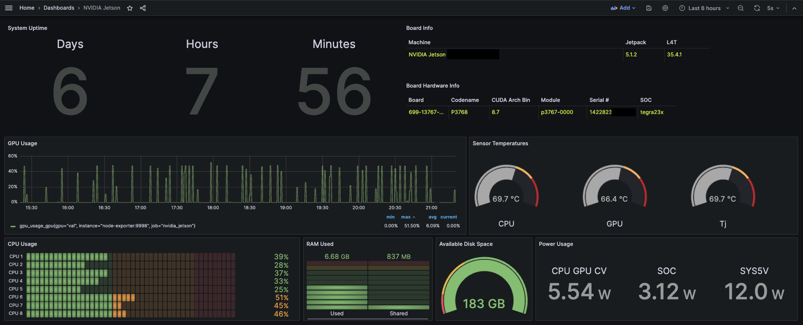

# jetson_stats_dashboard_monitor

## Installation
Clone this repository on your Jetson device and run docker compose. 

```bash
git clone https://github.com/quangdungluong/jetson_stats_dashboard_monitor
cd jetson_stats_dashboard_monitor
docker-compose up -d
```
Access to Prometheus, Grafana, and enjoy.

## Grafana dashboard
Navigate to `http://<host-ip>:3001` and login with user `admin` and password `admin`.

### Dashboard
